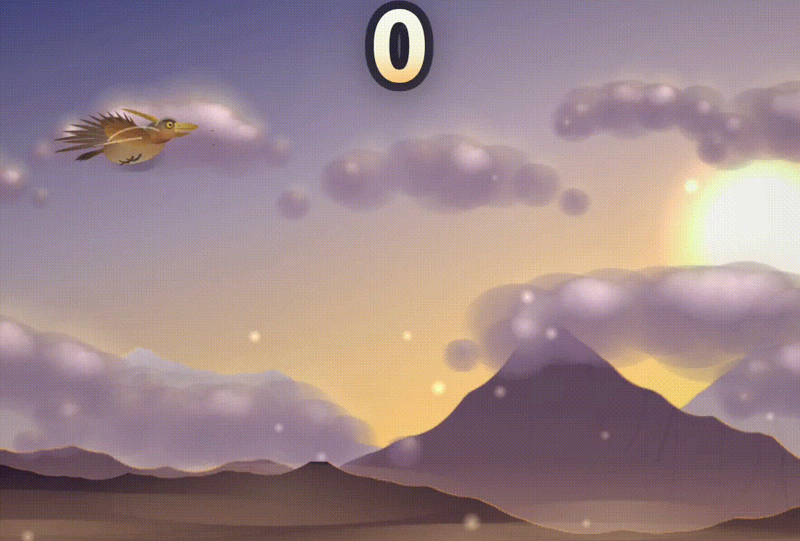

# Aetherwing

A one-button cinematic flight arcade game. Glide an ancient sky drake through colossal floating monoliths across five living skies.

**[Play the live demo](https://he-is-talha.github.io/aetherwing/)**



**Simple to learn. Hard to put down.** Click, tap, or press Space to beat your wings. Gravity does the rest.

```bash
npm install
npm run dev
```

Open the URL Vite prints (default `http://localhost:5173`).

Production build:

```bash
npm install
npm run build
npm run preview
```

The `dist/` folder is a static site. Drop it on any static host.

## Controls

| Action | Input |
| --- | --- |
| Fly | Click, tap, Space, W, ↑, Enter |
| Pause | Esc, P, or the pause button |
| Mute | M, or the speaker button |
| Restart | R, or tap after a crash |

## Skies

The world shifts as you climb. Unlock a sky as a starting world by reaching its score on any run.

| Sky | Unlocks at |
| --- | --- |
| Gilded Reach | 0 |
| Storm Vale | 12 |
| Hollow Frost | 26 |
| Neon Verge | 42 |
| Ember Fall | 60 |

Difficulty ramps gradually: 0–10 easy, 10–25 moderate, 25–50 hard, 50+ very hard.

## Save data

Best score, unlocks, and settings live in `localStorage` (`aetherwing.save.v1`). Nothing leaves the browser.

## Project layout

```
src/
  config/     physics, difficulty, sky themes
  core/       game loop, viewport, math, pooling
  entities/   flyer, monoliths, procedural gates
  render/     sky, terrain, creature, obstacles, HUD, post
  systems/    input, audio, particles, collision, save, quality
  ui/         menus and overlays
```

No backend, no API keys, no accounts. Audio is generated with the Web Audio API.

## License

MIT
